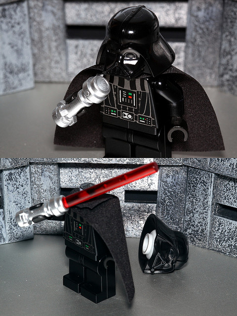
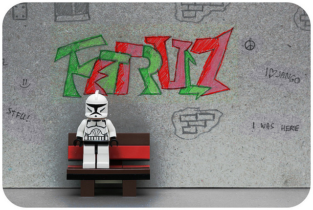
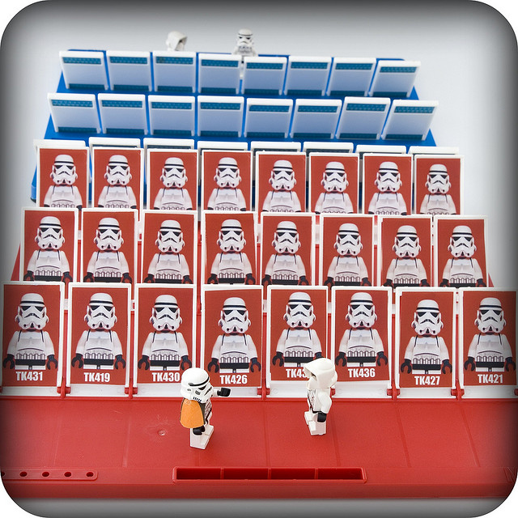
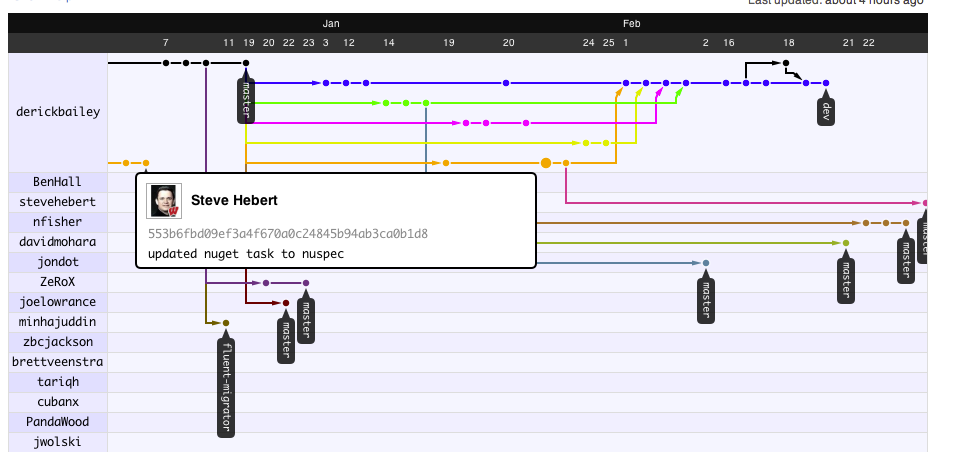
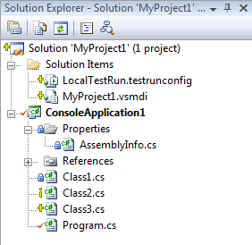
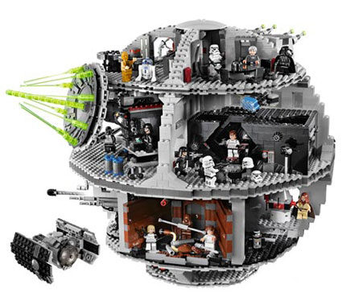
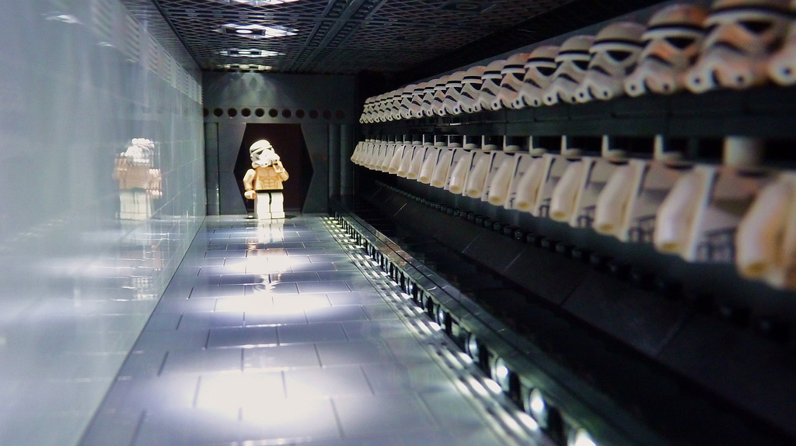
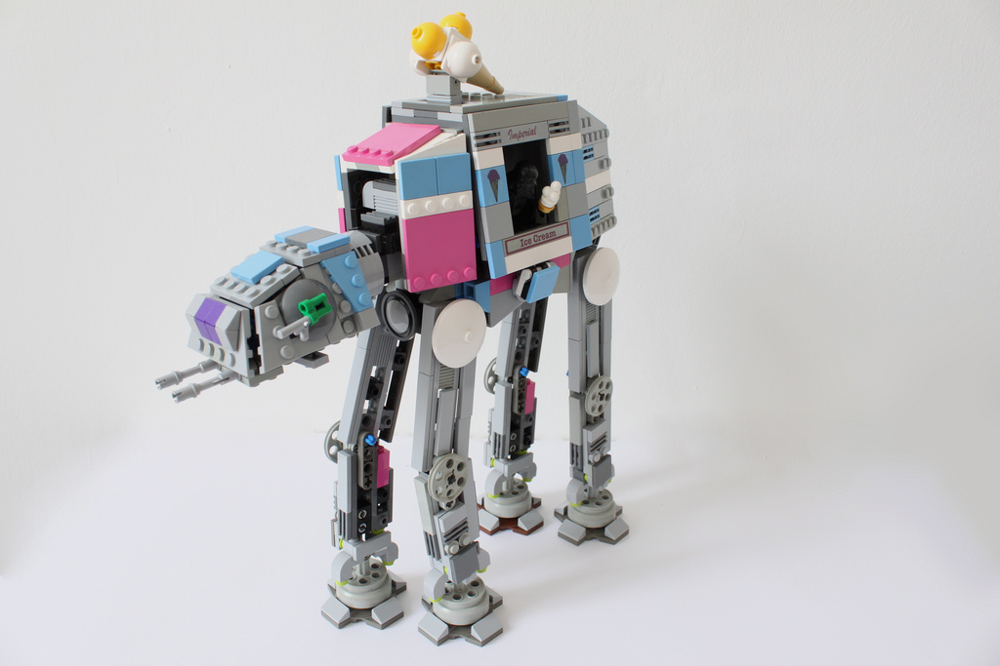

!SLIDE 

# Source Control Survey

!SLIDE center
# Who doesn't use source control?

!SLIDE center
#Git?

!SLIDE center  
# Visual Source Safe?

!SLIDE center
#TFS?

!SLIDE center
#SVN?

!SLIDE center
#hg?

!SLIDE center
# Other?

!SLIDE
# What's wrong with X?

!SLIDE center
# Slow

!SLIDE center
# Heavy

!SLIDE center
# Unfriendly 

!SLIDE center
# Restrictive

!SLIDE center
# Unstable 

!SLIDE center incremental bullets
# What do we want 
# our VCS to be?
* 

!SLIDE center
#...or maybe

!SLIDE center incremental bullets
# DVCS
*  Darth Vader Control System
* Distributed Version Control System

!SLIDE center incremental bullets
# No central server
* ...but typically we treat one as canonical 

!SLIDE center
# Every machine is an exact copy

!SLIDE center
# All work is local

!SLIDE bullets incremental
# Why is git better than _x_?
* [http://whygitisbetterthanx.com/](http://whygitisbetterthanx.com/)
* Built by Scott Chacon (a Githubber)

!SLIDE 
# Why do _I_ like git?

!SLIDE center
# It's fast

!SLIDE center
# It's agile

!SLIDE center
# It's powerful

!SLIDE center
# Branching is light

!SLIDE center 
# Essentially 

!SLIDE center
#...or maybe

!SLIDE 
# Enough fluff
# Let's get started

!SLIDE
# Installing Git

!SLIDE incremental bullets
# Linux & Mac OSX 
* via package manager

!SLIDE center
# msysgit on Windows
## http://code.google.com/p/msysgit/

!SLIDE center
# Warning! Command line!

!SLIDE incremental commandline
# Minimal Setup
    $ git config --global user.name 'Darth Vader'
    $ git config --global user.email dvader23@deathstar.org
    $ git config --global color.ui true

!SLIDE 
# Created the `~/.gitconfig`

    [user]
        email = dvader23@deathstar.org
        name = Darth Vader
    [color]
        ui = true

!SLIDE incremental bullets
# Config locations
* Global = `~/.gitconfig`
* Per Project =  `my-project/.git/config`

!SLIDE
# Create the repository

!SLIDE powercmd
# git init

!SLIDE incremental bullets whatthe
# What did that do?
* It created  `.git` directory
* In that directory _is_ the repository
* Commits, branches, tags, config end up here
* We'll look more at this later

!SLIDE 
#Copy a repository

!SLIDE powercmd
#git clone

!SLIDE incremental bullets whatthe
# What did that do?
* Copies every commit from the other repository 

!SLIDE
# See what changed

!SLIDE powercmd 
# git status

!SLIDE incremental commandline 
    $ git status
    On branch master
    Changed but not updated:
      (use "git add <file>..." to update what will be committed)
      (use "git checkout -- <file>..." to discard changes in working directory)

        	modified:   extra.css
	        modified:   git-dark-side/git-dark-side.md

    no changes added to commit (use "git add" and/or "git commit -a")

!SLIDE
#What lines actually changed?

!SLIDE powercmd
#git diff

!SLIDE 
# Select files to commit

!SLIDE powercmd
# git add 

!SLIDE whatthe
# WTF did that do?

!SLIDE incremental bullets
# The Staging Area

!SLIDE 
# Commit the files

!SLIDE powercmd
# git commit 

!SLIDE incremental commandline 
    $ git commit -m 'more changes'
    [master 464f706] more changes
     1 files changed, 1 insertions(+), 0 deletions(-)

!SLIDE 
# Revert uncommited mistakes

!SLIDE powercmd
#git reset

!SLIDE whatthe
# Reverts any files git __is__ tracking to their last known state.

!SLIDE powercmd
#git clean

!SLIDE whatthe
# Deletes any files git __is not__ currently tracking.

!SLIDE center
# Tracked vs Untracked Files

!SLIDE 
#Create a branch

!SLIDE powercmd
#git branch 

!SLIDE 
#Switch branches

!SLIDE powercmd
#git checkout

!SLIDE 
# `checkout` to the _working area_
# from the `.git` repository

!SLIDE 
#Merge two branches

!SLIDE powercmd
#git merge

!SLIDE 
#Share changes

!SLIDE powercmd
#git push

!SLIDE 
#See other's changes

!SLIDE powercmd
#git fetch

!SLIDE 
#Rewrite history

!SLIDE powercmd 
#git rebase

!SLIDE center
# More about `rebase` later

!SLIDE center

!SLIDE
# What have we learned?

!SLIDE code bullets incremental small
* git init
* git clone
* git add 
* git commit 
* git reset
* git clean

!SLIDE code bullets incremental small
* git branch
* git checkout 
* git merge
* git push
* get fetch
* get rebase

!SLIDE 
#Let's see it in action

!SLIDE

!SLIDE center
# `rebase`

!SLIDE 
# Never `rebase` after it's left your machine

!SLIDE
# Always `pull --rebase` if you `pull`

!SLIDE center 
# Squash the noise away

!SLIDE center
# tags 

!SLIDE incremental commandline
# log

    $ git log --oneline old-branch..master
    42047c0 adding a few more images
    4cf8760 adding tools
    edaf8a2 more images
    b901401 adding how changed lives
    1b63c94 git everything

!SLIDE incremental commandline
    $ git log --oneline --graph --decorate 
    *   b8d1fe8 (HEAD, master) Merge branch 'b'
    |\  
    | * 4a78951 (b) trying to do foo
    * | b4ebdfd fixing bug 23
    * | 4eb392c adding feature b
    |/  
    * cad93e9 initial commit

!SLIDE center
## `bisect`

!SLIDE center
# Hooks

!SLIDE center
# Github

!SLIDE center
#Fork and Pull Request

!SLIDE center

!SLIDE center
# Tooling

!SLIDE  incremental bullets
#Tooling for Tools
# is Amazing
* CI Server
* Github integration

!SLIDE center
# Git Extensions

!SLIDE center
# Git Source Control Provider

!SLIDE center
# How Git will change your life

!SLIDE center
# Git everything

!SLIDE center
# Commit often

!SLIDE center
# Branch for everything

!SLIDE center 
# Joining the Dark Side

!SLIDE center
## You won't loose your history...maybe
* 

!SLIDE center
# You don't _have_ to use git
## You can use several client tools w/ github

!SLIDE center
# You don't have to stop using _X_
## You can run git on top of just about anything

!SLIDE center

